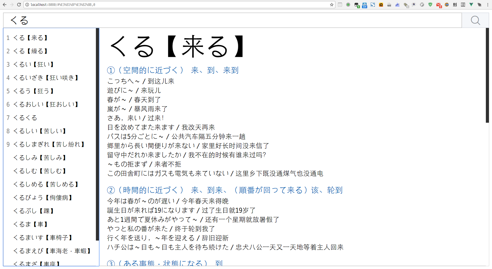

# iDict

一个简洁、智能、美观的词典。

前端基于Vue、后端基于Flask，使用Websocket通信。

## 预览



## 功能

支持前进、后退

## 快捷键

##### 全局

Esc 聚焦输入框并清空

输入框

Enter 查询单词（正则表达式）

##### 焦点位于侧栏

Tab/Shift+Tab 上下移动条目

E 聚焦输入框（不清空）

F 聚焦输入框（清空）


## Build Setup

``` bash
cd ./Web

# install dependencies
npm install

# serve with hot reload at localhost:8080
npm run dev

# build for production with minification
npm run build

# build for production and view the bundle analyzer report
npm run build --report
```

For a detailed explanation on how things work, check out the [guide](http://vuejs-templates.github.io/webpack/) and [docs for vue-loader](http://vuejs.github.io/vue-loader).
